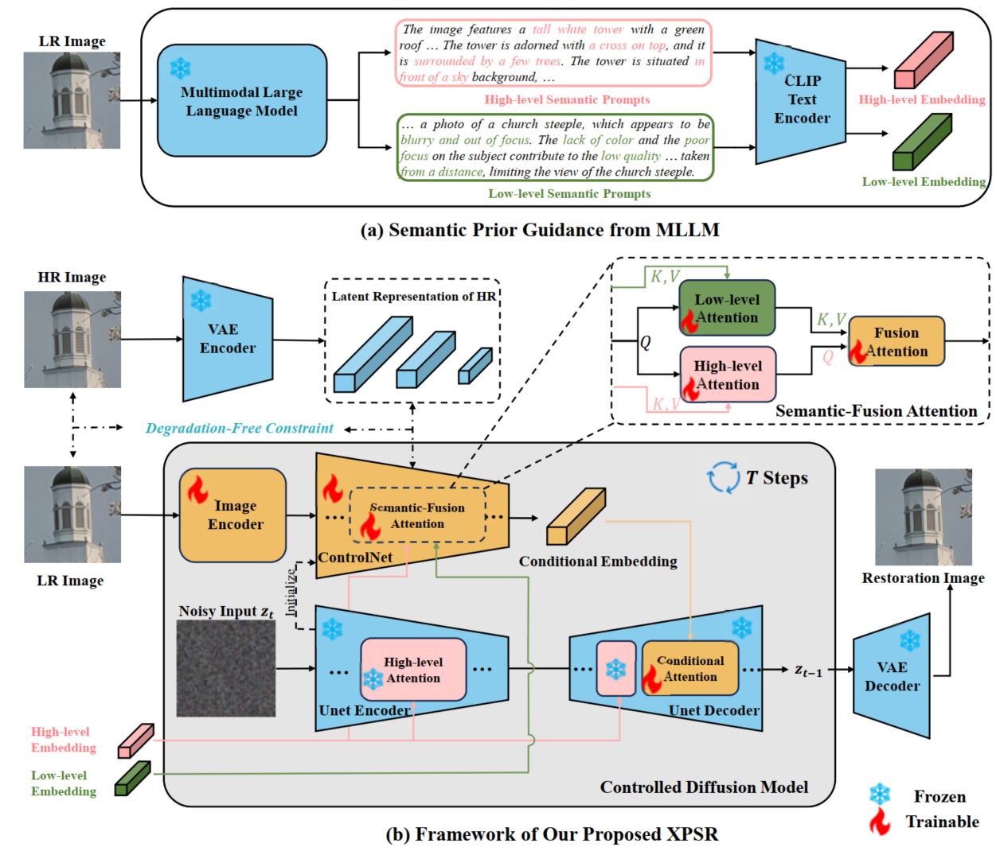
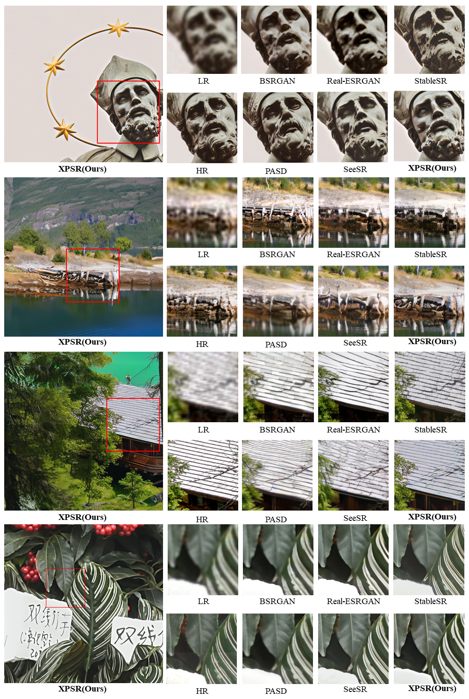

# XPSR: Cross-modal Priors for Diffusion-based Image Super-Resolution

[Paper](https://arxiv.org/abs/2403.05049)
<a href='https://arxiv.org/abs/2403.05049'></a> &nbsp;&nbsp;

Yunpeng Qu<sup>1,2</sup> | Kun Yuan<sup>2</sup> | Kai Zhao<sup>2</sup> | Qizhi Xie<sup>1,2</sup> | Jinhua Hao<sup>2</sup> | Ming Sun<sup>2</sup> | Chao Zhou<sup>2</sup>

<sup>1</sup>Tsinghua University, <sup>2</sup>Kuaishou Technology.

## Overview framework


Diffusion-based methods, endowed with a formidable generative prior, have received increasing attention in Image Super-Resolution (ISR) recently.  However, as low-resolution (LR) images often undergo severe degradation, it is challenging for ISR models to perceive the semantic and degradation information, resulting in restoration images with incorrect content or unrealistic artifacts. To address these issues, we propose a Cross-modal Priors for Super-Resolution (XPSR) framework. Within XPSR, to acquire precise and comprehensive semantic conditions for the diffusion model, cutting-edge Multimodal Large Language Models (MLLMs) are utilized. To facilitate better fusion of cross-modal priors, a Semantic-Fusion Attention is raised. To distill semantic-preserved information instead of undesired degradations, a Degradation-Free Constraint is attached between LR and its high-resolution (HR) counterpart. Quantitative and qualitative results show that XPSR is capable of generating high-fidelity and high-realism images across synthetic and real-world datasets.

## Results


## Installation
```
## git clone this repository
git clone https://github.com/qyp2000/XPSR.git
cd XPSR

# create an environment with python >= 3.9
conda create -n xpsr python=3.9
conda activate xpsr
pip install -r requirements.txt
```


## Inference
#### Step 1: Download the pretrained models and test data
- Download SD-v1.5 models from [huggingface](https://huggingface.co/runwayml/stable-diffusion-v1-5) and put them into ``checkpoints/stable-diffusion-v1-5``.
- Download pretrained XPSR model from [OneDrive](https://drive.google.com/drive/folders/1rzlHjp6DuiD7timULeDvmxSQignnMywS?usp=sharing) and put it into ``runs/xpsr``.
- Prepare testing images in the `testset`.

#### Step 2: Generate highlevel and lowlevel prompts
We use llava-v1.5-7b from [huggingface](https://huggingface.co/liuhaotian/llava-v1.5-7b) to generate high-level prompts.
In addition, in order to improve the model's perception of the low-level factors, we use the [MLLM](https://huggingface.co/DLight1551/internlm-xcomposer-vl-7b-qinstruct-full) finetuned through [q-instruct](https://q-future.github.io/Q-Instruct/) to generate low-level prompts.
You can also download the two MLLMs in advance and place them into ``checkpoints/``.
```
./utils_data/highlevel_prompt_test.sh
./utils_data/lowlevel_prompt_test.sh
```

#### Step 3: Run code
```
python test.py
```
You can modify the parameters in `xpsr.yaml` to adapt to your specific need, such as the `guidance_scale` and the `num_inference_steps`.

## Train 

#### Step1: Download the pretrained models and training data
- Download SD-v1.5 models from [huggingface](https://huggingface.co/runwayml/stable-diffusion-v1-5) and put them into ``checkpoints/stable-diffusion-v1-5``.
- Prepare training images in the `gt_path/`.

#### Step2: Generate training data
We generate training data based on the degradation pipelines of [Real-ESRGAN](https://openaccess.thecvf.com/content/ICCV2021W/AIM/html/Wang_Real-ESRGAN_Training_Real-World_Blind_Super-Resolution_With_Pure_Synthetic_Data_ICCVW_2021_paper.html).
The generated images will be saved in `trainset/`.
```
./utils_data/make_train.sh
```
Based on the same approach, corresponding degraded images can be generated for the testset.
```
./utils_data/make_valid.sh
```
You can modify the args in `make_valid.py` to adapt to your specific need.

#### Step3: Generate highlevel and lowlevel prompts
Due to the significant overhead of MLLMs, we generate prompts in advance for training data so that they can be directly called during training.
```
./utils_data/highlevel_prompt_train.sh
./utils_data/lowlevel_prompt_train.sh
```
This process requires a lot of time, and we suggest that you use as many GPUs as possible to participate in the generation.

#### Step4: Run code
```
CUDA_VISIBLE_DEVICES="0,1,2,3,4,5,6,7," accelerate launch train.py
```
You can modify the parameters in `xpsr.yaml` to adapt to your specific need, such as the `train_batch_size` and the `learning_rate`.


## Citations
If our work is useful for your research, please consider citing:
```
@article{qu2024xpsr,
  title={XPSR: Cross-modal Priors for Diffusion-based Image Super-Resolution},
  author={Qu, Yunpeng and Yuan, Kun and Zhao, Kai and Xie, Qizhi and Hao, Jinhua and Sun, Ming and Zhou, Chao},
  journal={arXiv preprint arXiv:2403.05049},
  year={2024}
}
```
## Contact
The reorganization of the codes are rushed, and there may be many problems.
Please feel free to contact: `qyp21@mails.tsinghua.edu.cn`. 
I am very pleased to communicate with you and will maintain this repository during my free time.

## Acknowledgments
Some codes are brought from [PASD](https://github.com/yangxy/PASD) and [SeeSR](https://github.com/cswry/SeeSR). Thanks for their excellent works.